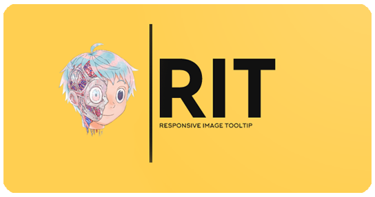

# RIT - Responsive Image Tooltip

## About

A simple set of tips for responsive images in pure html and css with examples of source code. 

### Possibilities:

- 6 methods for responsive images presented
- Correct display on all devices
- View examples with source code
- Application description for each method
---

     
